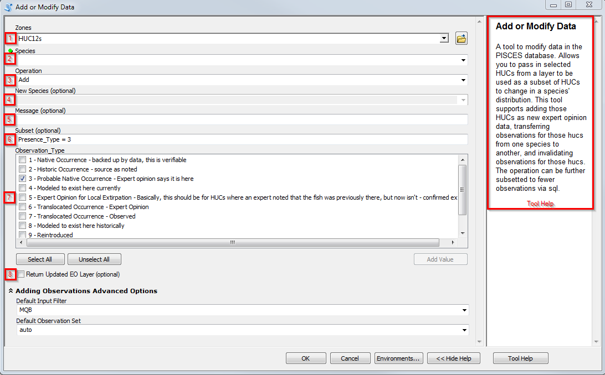

.. _addmodify:

Add or Modify Data
==================

1. **Select HUC12 Layer** - The feature class or feature layer that contains the zones (HUCs) that you want this tool to add, remove, or transfer. Allows you to pass in a subset of HUCs (selected using interactive selection or selection tools) to add or modify a species distribution. 

2. **Select Species to add or modify** - the target for the operation for the selected HUCs. For transferring records, this is the **from** species. The field supports autocomplete of species names and :term:`species code`. The "load" command in the species input box inserts the last species that was edited and places it into the field

3. **Operation** 
	* **Add** - selected HUC12s become new records for chosen species
	* **Transfer** - transfers records for selection from one species to another
	* **Remove** - invalidates records for selection. Records that are removed are placed in the  :ref:`Invalid_Observations<observations>` table. 

4. **Pick the destination species - Transfer only** - For transferring observations from one species to another, this is the **to** species

5. **Add Message** - details that are added to the database about the operation. For remove and transfer operations, this will be the invalidation message. For new data, this will be added to the notes field. This message should indicate the rationale for the change and source of the information.

6. **Subset Data with SQL - Transfer or Remove only** - a :ref:`SQL clause<sql_tutorial>` to subset transfer and remove operations. Do not include the "where" clause, but include all other SQL operators. This SQL statement overrides the options in the observations table.
	
	.. epigraph::
	
			Example: If you only want to operate on historical data from the MKS input filter, your subset query looks like input_filter = "MKS" and Presence_Type = 2
   
7. **Pick Observation Type - Add only** - check the boxes for the desired :ref:`observation presence type<obs-types>` when adding new records. Multiple observations types can be added to the same selection of HUC12s.

8. **Return Updated EO Layer** - Adds the updated expert opinion layer for the selection species to the current map document after records are added to the database. 

   