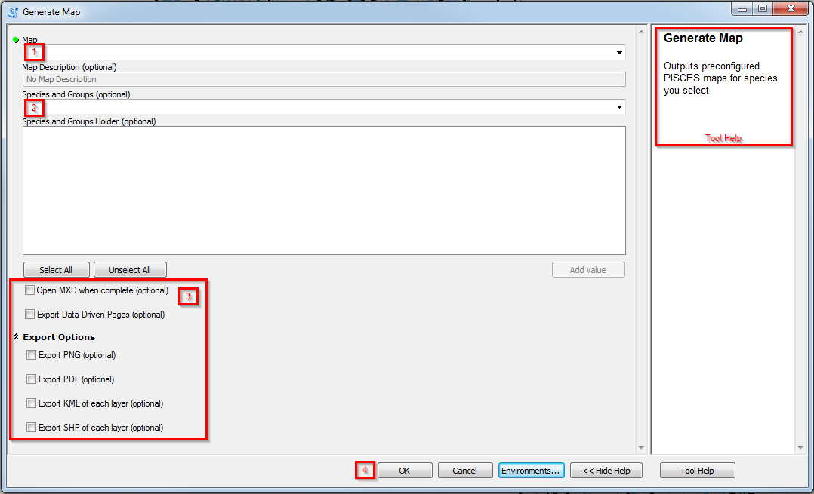

.. _gen-map:

Generate Map
==================

1. **Select the name of the desired map set**. See :ref:`common map outputs<map-output>` for a description of maps outputs. Supports autocomplete for preconfigured map sets. Selecting the option "Last Map Configuration" will output the last configuration that was run.

2. **Select species or species groups to run**. Depending on the map set, this selection is optional. Not all map sets need a species or groups to run, some are preconfigured to run overall metrics or "fishless" outputs that might require other parameters. The text box will automatically fill in when you start typing the :term:`species code` or the species common name (5 characters or more). Selections will be added to the Species and Groups Holder box (Uncheck any species or groups not wanted). 

3. **Output options** for the map set (all optional). Open MXD when complete will auto-open the map when finished, unless more than one MXD is produced. 

4. **Run!**
	* mxds saved to PISCES/mxds/output 
	* layers saved in the :term:`layer cache`
   	* Optional: images (PNGs & PDFs) saved to PISCES/maps/output

   
.. note::

	Make sure to check the "Close this dialog when completed successfully" box in the geoprocessing window. Opening a new ArcMap window freezes when a geoprocessing result is up.	

