.. _tools:

Tools
=====

The main interface with the PISCES database is through a collection of customized ArcGIS tools. These tools are found in the PISCES toolbox (PISCES\\tbx\\PISCES.tbx). Please see the :ref:`Setting up a New Map with PISCES tools<tutorials>` tutorial for instructions about adding the PISCES toolbox to a map document.
	
**The tools in the toolbox are broken up into three categories:**
	#. Management
	#. Modification
	#. Output
	
**More information and help for each tool is embedded in the tool interface.** Open the tool from the toolbox and click the **Show Help** button.

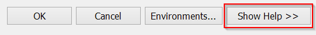

.. _tool-addhuc12:

Add HUC12 Attributes
--------------------

Inserts a boolean attribute (True or False) to the :ref:`Zones_Aux<table-zones-aux>` table in the database for each :term:`HUC12`. :ref:`Zones_Aux<table-zones-aux>` stores additional data about the properties of each :term:`HUC12`. HUCs in the selection (:ref:`See Selecting HUC12s tutorial for more info<tutorials>`) will be marked as True (1) while excluded HUCs will be False (0). By default the tool adds a new column to the :ref:`Zones_Aux table<table-zones-aux>`, but if a field name already exists the tool will update the values.

:download:`Full tool help documentation<tool_help/add_huc12_attributes_tool_help_2.0.html>`

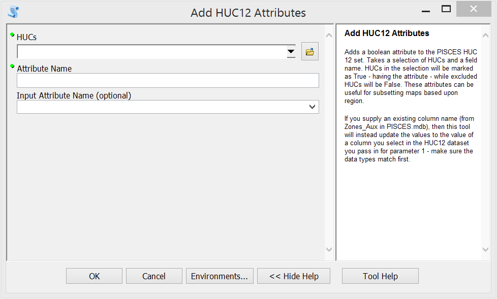

.. _tool-altcodes:
		
Add Unique Field Values as Alt Codes
------------------------------------

Extracts all of the unique values for a species ID field in a table or feature class and adds the values as :term:`alt codes` for an :term:`input filter`. Alt Codes are names or abbreviations for taxa that can be cross-referenced to a single :term:`species code`. Prior to importing the dataset, each Alt Code should be linked to a single PISCES :term:`species code`. Unknown or unresolved taxonomy can be place in temporary data :term:`bins`. 

The crossed-referenced links can be established during an ArcGIS editing session (add a column with the PISCES species codes) or afterwards in the :ref:`Alt_Codes table<table-altcodes>` in the PISCES database. 

:download:`Full tool help documentation<tool_help/add_unique_field_values_tool_help_2.0.html>`

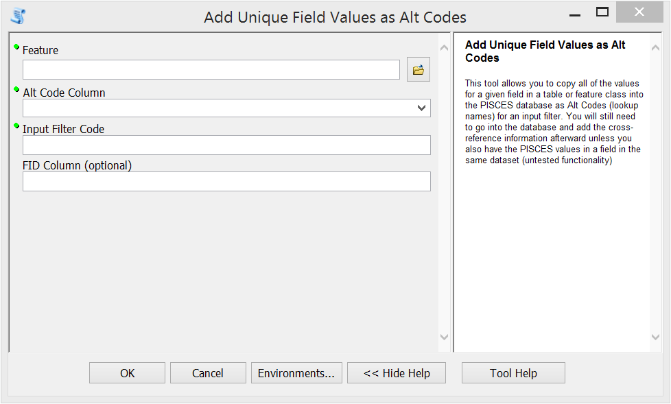
	
.. _tool-import-dataset:
	
Import Dataset
--------------

Import a dataset when the :ref:`input filter<input-filters>` and :ref:`species code mappings<table-altcodes>` already exist.

:download:`Full tool help documentation<tool_help/import_dataset_tool_help_2.0.html>`

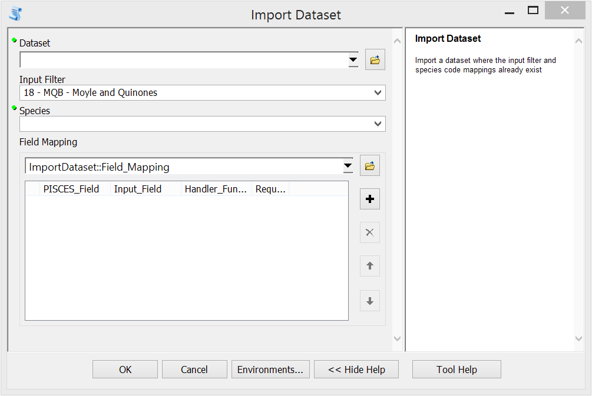

.. _tool-retry-import:

Retry Import
------------
Retry a failed import. Imports occur in two stages - setting the metadata into the database to stage the import, then the actual import. If the metadata setup occurred successfully in the :ref:`Import Dataset tool<tool-import-dataset>`, but the overall import failed, you can select the dataset to try again with this tool.

:download:`Full tool help documentation<tool_help/retry_import_tool_help_2.0.html>`

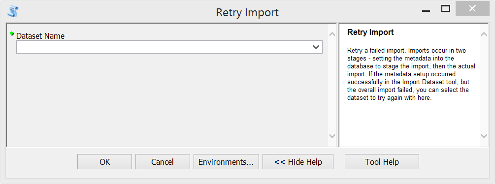
	

.. _tool-addmodify-data:

Add or Modify Data
------------------
Modifies data in the database by using a selection of HUC12s (:ref:`See Selecting HUC12s tutorial for more info<tutorials>`) to change a species distribution. This tool supports adding new data, transferring observations from one species to another, and invalidating observations. 

:download:`Full tool help documentation<tool_help/add_or_modify_data_tool_help_2.0.html>`

:ref:`More information about using the Add or Modify Data Tool<addmodify>`
		
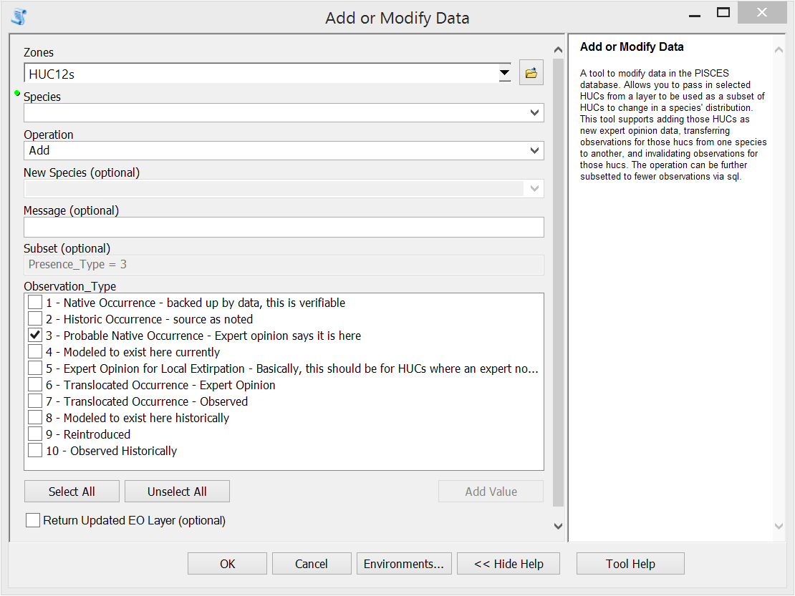

.. _tool-add2collection:

Add Species Data to Collection
------------------------------
Appends new records for a species to a :ref:`collection<collections>`. The tool adds the unique observation identification number for each record to the Observation_Collection table in the database. The tool only works on a single species at a time. This tool is often used to add individual species to :ref:`quality controlled data collections<qc-data>` after additions or changes to ranges are accepted by taxa experts.

:download:`Full tool help documentation<tool_help/add_species_data_to_collection_tool_help_2.0.html>`

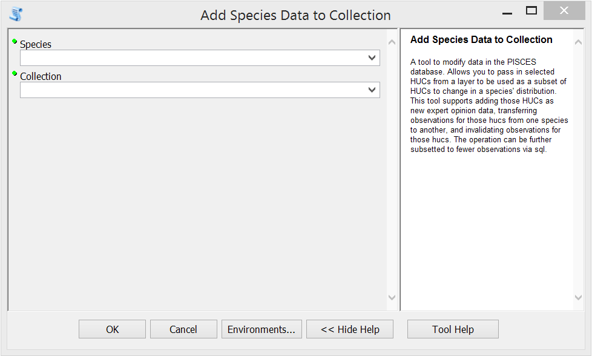
	
	

.. _tool-undo-transaction:

Undo Transaction
----------------
Records that were removed using the :ref:`Add or Modify Data tool<tool-addmodify-data>` can be reverted by selecting the appropriate transaction. Please see the :ref:`Transaction Table<table-transactions>` or the :ref:`Invalid Observation Table<table-invalid-observations>` to find the appropriate transaction ID. Be aware that this tool will restore **all records** for the transaction. 

:download:`Full tool help documentation<tool_help/undo_transaction_tool_help_2.0.html>`

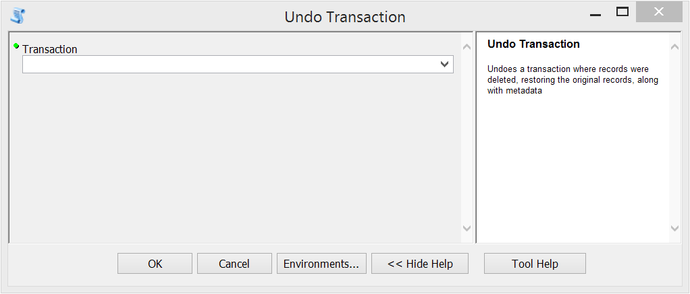

	
.. _tool-generate-layer:

Generate Layer from Query
-------------------------
Produces a custom layer using SQL query syntax. Layers can be produced using :ref:`callback functions and arguments<map-callbacks>`. This tool can be used to create custom layers from the database but if the query is going to be implemented multiple times, it is better to create a new :ref:`map set<defs-query-sets>`. 

:download:`Full tool help documentation<tool_help/generate_layer_from_query_tool_help_2.0.html>`

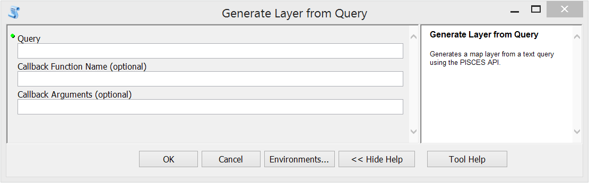

.. _map-output:	
.. _tool-generate-map:

Generate Map
------------
Outputs preconfigured PISCES :ref:`map sets<defs-query-sets>` for species or groups.
	
:ref:`More information about using the Generate Map Tool<gen-map>`

:download:`Full tool help documentation<tool_help/generate_map_tool_help_2.0.html>`

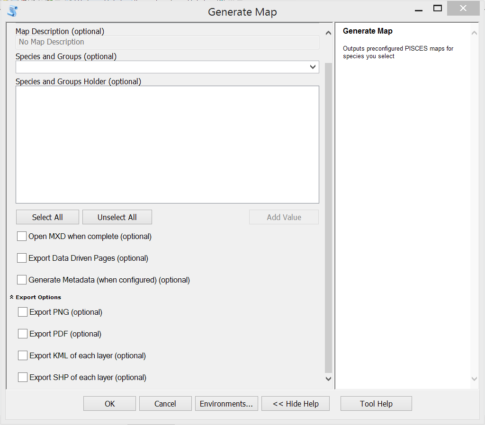

	
**Common Map Outputs**

.. list-table::
	:widths: 8 30
	:header-rows: 1
		
	* - Map Set 
	  - Description
	* - Main Range Maps
	  - Outputs all :ref:`quality controlled data<qc-data>` for the selected species	 
	* - Unlimited Range Maps
	  - Outputs maps will **ALL** data. Doesn't limit results to :ref:`quality controlled records<qc-data>` 
	* - Species Richness
	  - A basic alpha richness map for all fish
	* - Native Richness
	  - A basic alpha richness map run for only native fish
	* - Nonnative Richness
	  - A basic alpha richness map run for nonnative fish
	* - Richness Difference
	  - Calculates the difference between current and historical assemblages. Runs the :ref:`richness_difference callback function<map-callbacks>`.
	* - Sensitive Native Taxa
	  - Alpha richness of sensitive native species in each HUC12. Species status scores found in :ref:`Species_Aux<species-aux>`.

.. _tool-species-matrix:		
			
Generate Species Matrix
-----------------------
Generates a presence/absence matrix for a species, species group, or list of species. Exports matrix as a comma separated value table. Using a custom SQL query will override the default database query and allow custom exports. Any data can be added to the SQL query, so long as it returns HUCs that represent something about a species at a location. 

:download:`Full tool help documentation<tool_help/generate_species_matrix_tool_help_2.0.html>`

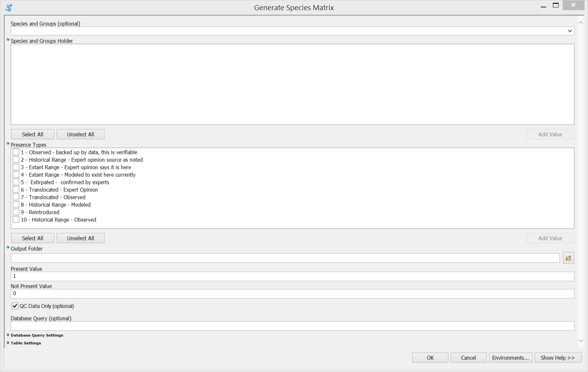

.. _tool-look-up-records:
	
Look Up Records
---------------
This tool looks up records related to a selection of HUC12s and returns them as a table into the ArcMap table of contents. Optional parameters can filter records matching :ref:`species<species-table>`, :ref:`observation type<obs-types>`, or :ref:`collection<collections>`. 

:download:`Full tool help documentation<tool_help/look_up_records_tool_help_2.0.html>`

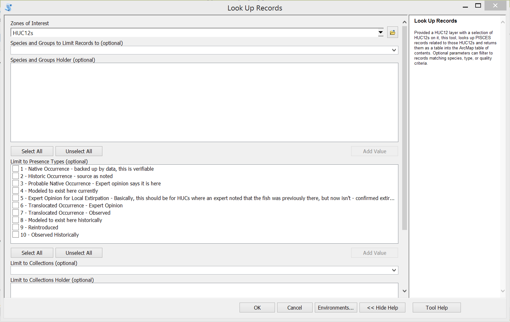
	
.. _tool-summary-stats:

Summary Stats
-------------
The tool runs a number of summary calculations about the number of records in the database. A table with the current database summary statistics will be generated and then added to the table of contents. Metrics include the number of records, number of datasets and the number of species.

:download:`Full tool help documentation<tool_help/summary_stats_tool_help_2.0.html>`

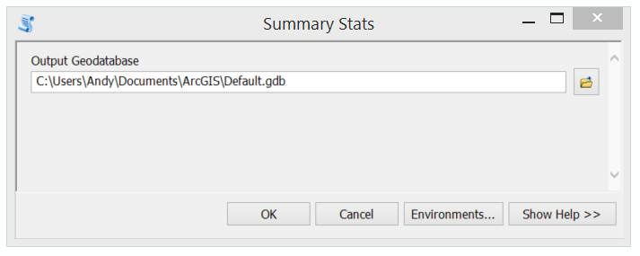

.. _tool-config:

Change Configuration Options
----------------------------
The tool allows the user to change the default options, switch on debug mode, change user profile, change default, export formats and location, and set the database location. 

:download:`Full tool help documentation<tool_help/change_configuration_options_tool_help_2.0.html>`

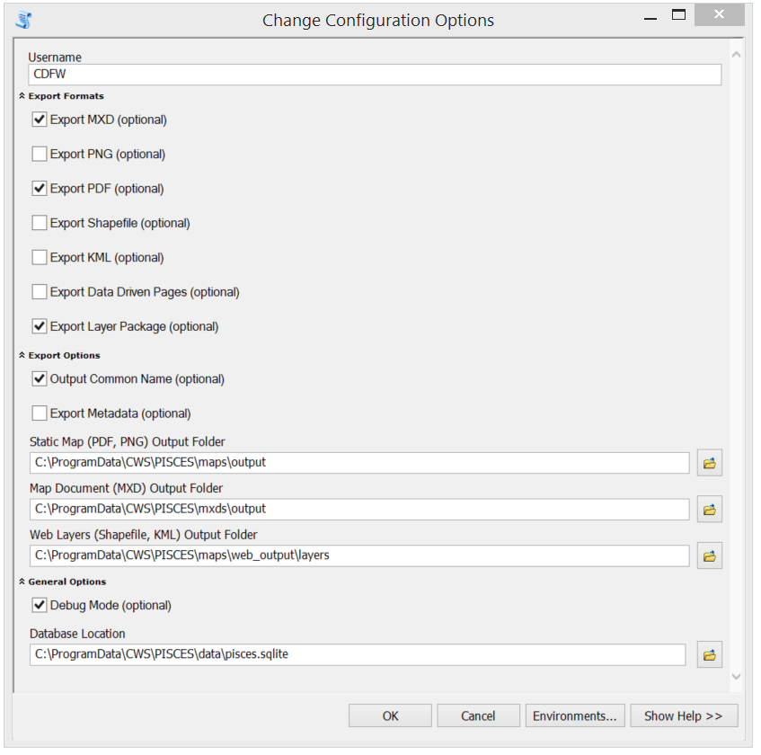

