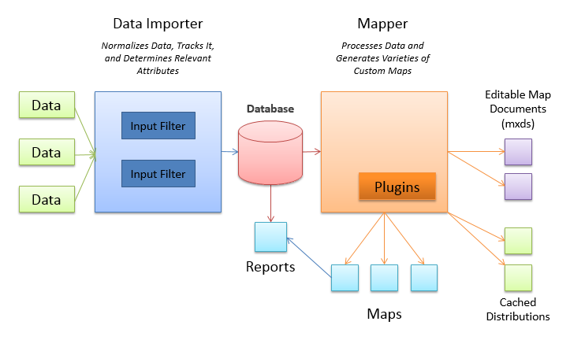

.. _use:

Overview
========

What is PISCES?
----------------
**PISCES** is an acronym for a **Programmable** Geographic **Information** **System** for **Cataloging** and **Encoding** **Species** observations

Purpose
********
PISCES is software that is designed to capture, store, map and report on the spatial and temporal dynamics of aquatic species using standard spatial units as primary indexing objects. The system is set up to be used for the inventory and mapping of native freshwater fish in California, but the underlying framework is agnostic to biological taxonomy or spatial extent. 

PISCES standardizes, maps and helps analyse the spatial distribution of aquatic species by using hydrologic units to translate observations and expert option into an electronic record of occurrences. Hydrologic units are the geographic area representing a surface drainage basin or a distinct hydrologic feature (often referred to as watersheds). Hydrologic units have unique identification codes for each watershed in the United States. The software uses the United States Geological Survey Hydrologic Unit Code 12 - subwatersheds boundaries (:term:`HUC12s`) as the common unit in the database. 

At the core, PISCES is a database for aquatic species presence/absence data. It is software written in Python that connects to ArcGIS and combines all the available data for fish species and lets the user process it, combine it, store it, and view it, regardless of data storage format, design, or scale. Python scripts are designed to 
standardize records, automatically track metadata and produce pre-configured batched map outputs.  It is used to store and catalog the spatial and temporal dynamics of aquatic species ranges using :term:`HUC12` watershed units.

Schema
-------

Components
-----------

Data
******
Each record in the database is a :ref:`species<species-table>`, in a watershed (:term:`HUC12`), at a :ref:`time<obs-types>`, attributed to a :ref:`source<metadata>` and with appropriate :ref:`metadata<metadata>`. Datasets with fish observations and records are combined with expert knowledge to get the most comprehensive database of native fish species locations in California. PISCES includes complete range data for all 131 of California’s native freshwater fish taxa. The data also includes historical ranges as well as translocation data for non-native fish species in California.
	
For more information, see :ref:`Data Storage <data>`.

Mapping
********
The software automatically generates appropriate rangemaps that layer multiple data types for all taxa with minimal configuration. Through basic plugins, PISCES generates complex maps that relate biological, climatic, and spatial variables. The mapping component can combine, summarize and synthesize data while relating it to important human and environmental factors. All maps can be easily regenerated as new data is incorporated.

For more information, see :ref:`Mapping <mapping>`.

